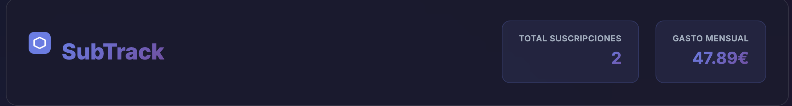

# 📊 SubTrack - Gestor de Suscripciones

<div align="center">


**Aplicación web moderna para gestionar todas tus suscripciones en un solo lugar**

[](https://spring.io/projects/spring-boot)
[](https://openjdk.org/)
[](https://developer.mozilla.org/en-US/docs/Web/HTML)
[](https://developer.mozilla.org/en-US/docs/Web/CSS)
[](https://developer.mozilla.org/en-US/docs/Web/JavaScript)
[](https://www.h2database.com/)

[Características](#-características) • [Tecnologías](#-tecnologías) • [Instalación](#-instalación) • [Uso](#-uso) • [API](#-api-rest)

</div>

---

## 📸 Capturas de Pantalla

<div align="center">
  
  <p><em>Dashboard principal con estadísticas y lista de suscripciones</em></p>
</div>

## ✨ Características

- 🎨 **Interfaz Moderna**: Diseño dark mode con glassmorphism y animaciones suaves
- 📊 **Estadísticas en Tiempo Real**: Visualiza el número total de suscripciones y gasto mensual
- ➕ **Gestión Completa**: Añade, visualiza y elimina suscripciones fácilmente
- 🏷️ **Categorización**: Organiza tus suscripciones por categorías (Streaming, Música, Software, etc.)
- 📅 **Control de Fechas**: Validación automática para evitar fechas pasadas
- 💾 **Persistencia de Datos**: Base de datos H2 integrada
- ✅ **Validación Robusta**: Validación tanto en frontend como backend
- 🚀 **API REST**: Backend completo con Spring Boot
- 📱 **Responsive Design**: Adaptado para todos los dispositivos

## 🛠️ Tecnologías

### Backend
- **Java 21** - Lenguaje de programación
- **Spring Boot 4.0.2** - Framework principal
  - Spring Web - API REST
  - Spring Data JPA - Persistencia de datos
  - Spring Boot Validation - Validación de datos
- **H2 Database** - Base de datos en memoria
- **Lombok** - Reducción de código boilerplate
- **Maven** - Gestión de dependencias

### Frontend
- **HTML5** - Estructura semántica
- **CSS3** - Estilos modernos con:
  - Variables CSS
  - Flexbox y Grid
  - Animaciones y transiciones
  - Glassmorphism
- **JavaScript Vanilla** - Lógica del cliente
  - Fetch API para comunicación con backend
  - DOM manipulation
  - Validación de formularios

## 📋 Requisitos Previos

Antes de comenzar, asegúrate de tener instalado:

- **Java JDK 17 o superior** ([Descargar](https://adoptium.net/))
- **Maven 3.6+** (incluido en el wrapper del proyecto)
- **Git** ([Descargar](https://git-scm.com/))

## 🚀 Instalación

### 1. Clonar el Repositorio

```bash
git clone https://github.com/tu-usuario/subtrack.git
cd subtrack
```

### 2. Compilar el Proyecto

#### En Linux/macOS:
```bash
./mvnw clean install
```

#### En Windows:
```cmd
mvnw.cmd clean install
```

### 3. Ejecutar la Aplicación

#### En Linux/macOS:
```bash
./mvnw spring-boot:run
```

#### En Windows:
```cmd
mvnw.cmd spring-boot:run
```

### 4. Acceder a la Aplicación

Abre tu navegador y visita:
```
http://localhost:8080
```

¡Listo! La aplicación debería estar funcionando con datos de prueba precargados.

## 💡 Uso

### Añadir una Suscripción

1. Completa el formulario "Nueva Suscripción":
   - **Nombre del Servicio**: Ej. "Netflix", "Spotify"
   - **Precio Mensual**: Ej. "9.99"
   - **Categoría**: Selecciona una categoría del desplegable
   - **Fecha de Renovación**: Selecciona la próxima fecha de cobro

2. Haz clic en **"Añadir Suscripción"**

3. La suscripción aparecerá inmediatamente en la lista y las estadísticas se actualizarán

### Eliminar una Suscripción

1. Localiza la suscripción que deseas eliminar
2. Haz clic en el botón **"Eliminar"**
3. Confirma la acción en el diálogo

### Ver Estadísticas

Las estadísticas se actualizan automáticamente en el header:
- **Total Suscripciones**: Número total de suscripciones activas
- **Gasto Mensual**: Suma total de todos los precios mensuales

## 🔌 API REST

### Endpoints Disponibles

#### Obtener todas las suscripciones
```http
GET /api/subscriptions
```

**Respuesta:**
```json
[
  {
    "id": 1,
    "serviceName": "Netflix Premium",
    "price": 17.99,
    "currency": "EUR",
    "frequency": "MONTHLY",
    "category": "Streaming",
    "billingDate": "2026-02-07"
  }
]
```

#### Crear una nueva suscripción
```http
POST /api/subscriptions
Content-Type: application/json
```

**Body:**
```json
{
  "serviceName": "Disney+",
  "price": 8.99,
  "currency": "EUR",
  "frequency": "MONTHLY",
  "category": "Streaming",
  "billingDate": "2026-03-01"
}
```

**Respuesta:**
```json
{
  "id": 4,
  "serviceName": "Disney+",
  "price": 8.99,
  "currency": "EUR",
  "frequency": "MONTHLY",
  "category": "Streaming",
  "billingDate": "2026-03-01"
}
```

## 📁 Estructura del Proyecto

```
subtrack/
├── src/
│   ├── main/
│   │   ├── java/com/portfolio/subtrack/
│   │   │   ├── controller/          # Controladores REST
│   │   │   ├── entity/              # Entidades JPA
│   │   │   ├── repository/          # Repositorios JPA
│   │   │   ├── service/             # Lógica de negocio
│   │   │   ├── DataLoader.java      # Carga de datos de prueba
│   │   │   └── SubtrackApplication.java
│   │   └── resources/
│   │       ├── static/              # Frontend
│   │       │   ├── index.html       # Página principal
│   │       │   ├── styles.css       # Estilos
│   │       │   └── app.js           # Lógica JavaScript
│   │       └── application.properties
│   └── test/                        # Tests
├── .gitignore
├── pom.xml                          # Configuración Maven
├── mvnw                             # Maven Wrapper (Linux/macOS)
├── mvnw.cmd                         # Maven Wrapper (Windows)
└── README.md
```

## 🔧 Configuración

### Base de Datos

Por defecto, la aplicación usa H2 en memoria. Los datos se reinician cada vez que se reinicia la aplicación.

Para cambiar a una base de datos persistente, edita `src/main/resources/application.properties`:

```properties
# H2 Persistente
spring.datasource.url=jdbc:h2:file:./data/subtrack
spring.jpa.hibernate.ddl-auto=update
```

### Puerto del Servidor

Para cambiar el puerto (por defecto 8080):

```properties
server.port=8081
```

## 🧪 Tests

Ejecutar los tests:

```bash
./mvnw test
```

## 📦 Compilar para Producción

Crear un JAR ejecutable:

```bash
./mvnw clean package
```

El archivo JAR se generará en `target/subtrack-0.0.1-SNAPSHOT.jar`

Ejecutar el JAR:

```bash
java -jar target/subtrack-0.0.1-SNAPSHOT.jar
```

## 🤝 Contribuir

Las contribuciones son bienvenidas! Por favor:

1. Fork el proyecto
2. Crea una rama para tu feature (`git checkout -b feature/AmazingFeature`)
3. Commit tus cambios (`git commit -m 'Add some AmazingFeature'`)
4. Push a la rama (`git push origin feature/AmazingFeature`)
5. Abre un Pull Request

## 📝 Licencia

Este proyecto está bajo la Licencia MIT. Ver el archivo `LICENSE` para más detalles.

## 👨‍💻 Autor

**Elias MP**

- GitHub: [@EliasM87](https://github.com/EliasM87)
- LinkedIn: [Elias Marin Perez](https://www.linkedin.com/in/elias-marin/)

## 🙏 Agradecimientos

- [Spring Boot](https://spring.io/projects/spring-boot) - Framework backend
- [Google Fonts](https://fonts.google.com/) - Tipografía Inter
- [Shields.io](https://shields.io/) - Badges del README

---

<div align="center">
  <p>Hecho con ❤️ y ☕</p>
  <p>⭐ Si te gusta este proyecto, dale una estrella en GitHub!</p>
</div>
